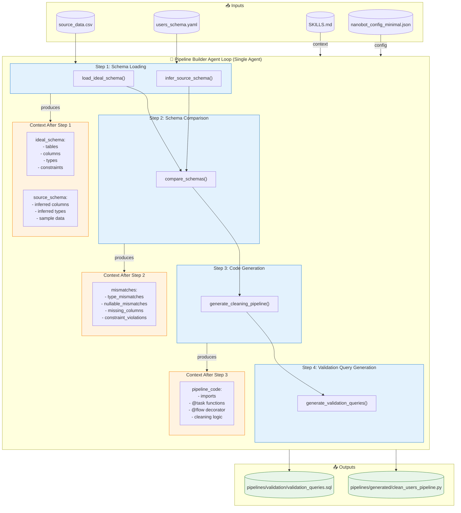
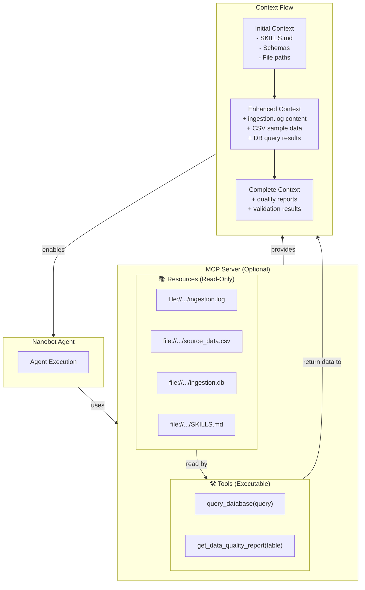
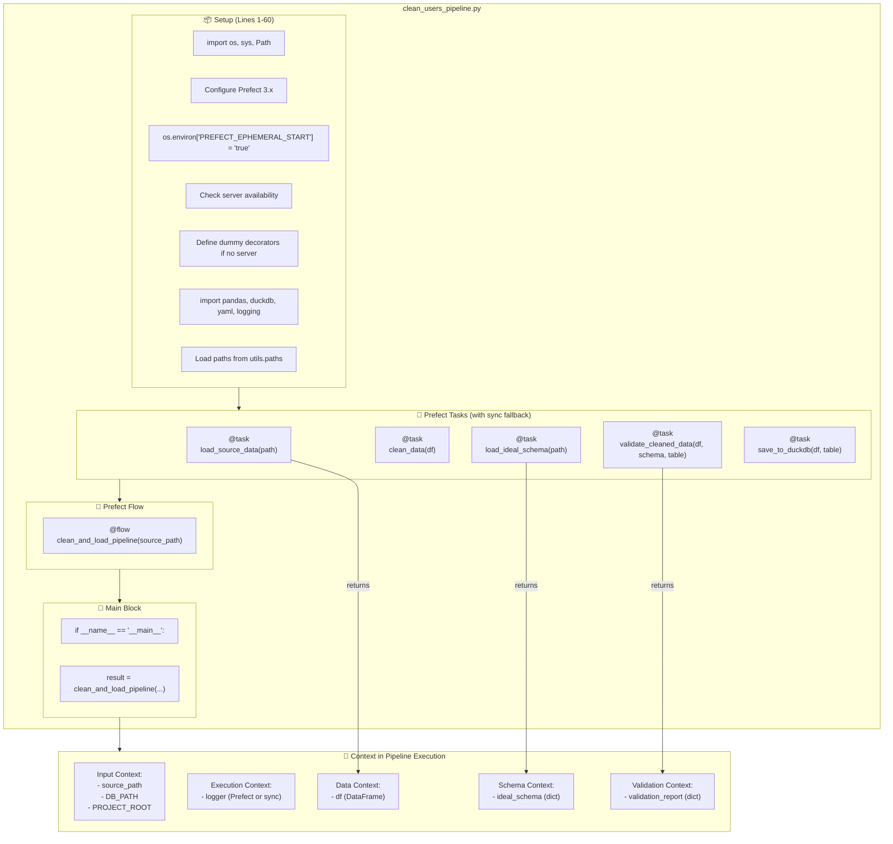
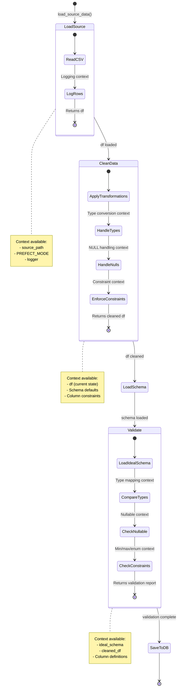
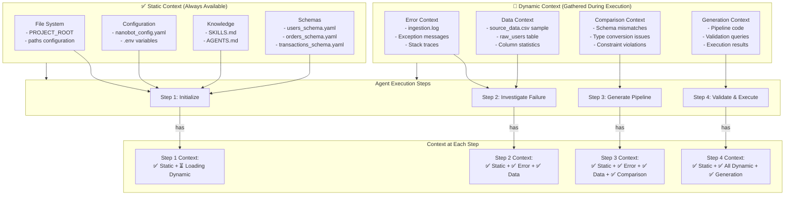
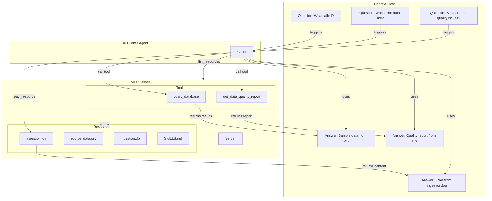

# Architecture Diagrams - Loops Data Ingestion System

This document contains detailed **Mermaid diagrams** describing the system architecture at multiple levels of detail. For high-level overviews, see [README.md](README.md#architecture-hybrid-pipeline-model).

---

## Table of Contents

1. [Level 3: Pipeline Generation Workflow](#level-3-pipeline-generation-workflow)
2. [Level 4: Component Interaction with Agent Context](#level-4-component-interaction-with-agent-context)
3. [Level 5: Individual Pipeline Structure](#level-5-individual-pipeline-structure)
4. [Agent Context Flow Diagram](#agent-context-flow-diagram)
5. [MCP Server Integration Details](#mcp-server-integration-details)
6. [Error Handling and Retry Logic](#error-handling-and-retry-logic)

---

## Level 3: Pipeline Generation Workflow

This diagram shows the **agentic loop** for pipeline generation, including context that flows through each step.



### Context Flow Summary

| Step | Agent Action | Context Added | Context Used |
|------|--------------|---------------|---------------|
| 1 | Load schemas | ideal_schema, source_schema | File paths, SKILLS.md |
| 2 | Compare schemas | mismatches, type_mismatches | ideal_schema, source_schema |
| 3 | Generate pipeline | pipeline_code, transformations | mismatches, schemas |
| 4 | Generate validation | validation_queries | pipeline_code, ideal_schema |

---

## Level 4: Component Interaction with Agent Context

This **sequence diagram** shows how `run_demo.py` orchestrates the components and what context is passed between them.

```mermaid
sequenceDiagram
    participant RD as run_demo.py
    participant T1 as ingestion_flow.py
    participant DB as DuckDB
    participant Agent as Nanobot Agent
    participant T2 as clean_users_pipeline.py
    participant MCP as MCP Server
    
    Note over RD,MCP: 📁 PROJECT CONTEXT (Always Available)
    Note over RD,MCP: - PROJECT_ROOT
    Note over RD,MCP: - paths configuration
    Note over RD,MCP: - OPENAI_API_KEY
    
    RD->>T1: Runs Prefect flow
    T1->>DB: CREATE raw_users table
    T1->>DB: COPY source_data.csv → raw_users
    T1->>DB: TRANSFORM → users (❌ FAILS)
    
    Note over T1,DB: ⚠️ CONTEXT CAPTURED:
    Note over T1,DB: - logs/ingestion.log
    Note over T1,DB: - raw_users table state
    Note over T1,DB: - Error details
    
    T1-->>RD: Returns failure + error context
    
    RD->>Agent: Initialize with context
    
    Note over Agent: 🎯 AGENT CONTEXT LOADED:
    Note over Agent: - SKILLS.md (skills)
    Note over Agent: - schemas/users_schema.yaml
    Note over Agent: - paths configuration
    Note over Agent: - Nanobot tools registered
    
    loop Investigation Loop (Agent)
        Agent->>Agent: Register tools from nanobot_tools.py
        
        Note over Agent: 🔧 TOOLS AVAILABLE:
        Note over Agent: - inspect_file(path, sample_size)
        Note over Agent: - check_schema(path, schema)
        Note over Agent: - query_duckdb(query)
        Note over Agent: - get_ingestion_status()
        
        Agent->>Agent: inspect_file("data/source_data.csv", 10)
        
        Note over Agent: 📊 CONTEXT UPDATED:
        Note over Agent: - source file metadata
        Note over Agent: - column names
        Note over Agent: - sample rows
        
        Agent->>DB: query_duckdb("SELECT * FROM raw_users LIMIT 10")
        
        Note over Agent: 📊 CONTEXT UPDATED:
        Note over Agent: - raw data state
        Note over Agent: - NULL counts per column
        Note over Agent: - invalid data samples
        
        Agent->>Agent: check_schema("data/source_data.csv", ideal_schema)
        
        Note over Agent: 🎯 FINDINGS:
        Note over Agent: - NULL email at row 6
        Note over Agent: - Invalid age 'N/A' at row 7
        Note over Agent: - Malformed email at row 11
        
        Agent->>Agent: analyze_schemas()
        
        Note over Agent: 📊 CONTEXT UPDATED:
        Note over Agent: - type_mismatches: [age, join_date, score]
        Note over Agent: - nullable_violations: [email, name]
        Note over Agent: - constraint_issues: [status enum]
    end
    
    Agent->>Agent: Register pipeline_builder tools
    
    Note over Agent: 🔧 ADDITIONAL TOOLS AVAILABLE:
    Note over Agent: - load_ideal_schema(path)
    Note over Agent: - infer_source_schema(path, sample_size)
    Note over Agent: - compare_schemas(source_path, ideal_path)
    Note over Agent: - generate_cleaning_pipeline(...)
    
    loop Pipeline Generation Loop (Agent)
        Agent->>Agent: load_ideal_schema("schemas/users_schema.yaml")
        Agent->>Agent: infer_source_schema("data/source_data.csv", 10)
        Agent->>Agent: compare_schemas(source, ideal)
        
        Note over Agent: 📊 CONTEXT UPDATED:
        Note over Agent: - comparison: {type_mismatches, nullable_diff, ...}
        
        Agent->>Agent: generate_cleaning_pipeline()
        
        Note over Agent: ✅ PIPELINE GENERATED
        
        Agent->>RD: Returns pipeline_code
    end
    
    RD->>RD: Saves to pipelines/generated/clean_users_pipeline.py
    RD->>T2: Runs generated pipeline
    
    Note over T2,DB: 📁 PIPELINE CONTEXT:
    Note over T2,DB: - source_path: data/source_data.csv
    Note over T2,DB: - schema_path: schemas/users_schema.yaml
    Note over T2,DB: - output_table: users_clean
    
    T2->>DB: Load source data
    T2->>DB: clean_data() - applies transformations
    T2->>DB: validate_cleaned_data()
    T2->>DB: save_to_duckdb() → users_clean
    
    Note over T2,DB: ✅ CLEANING SUCCESSFUL
    
    classDef contextNote fill:#fff9c4,stroke:#f57f17
    classDef action fill:#e3f2fd,stroke:#1976d2
    classDef success fill:#c8e6c9,stroke:#2e7d32
    classDef failure fill:#ffcdd2,stroke:#c62828
```

### MCP Server Integration in Context Flow

The MCP server provides **additional read-only context** that can be accessed by the agent:



**MCP Server provides:**
- **Static context**: SKILLS.md, source files, logs (via Resources)
- **Dynamic context**: Database query results, quality reports (via Tools)
- **No state modification**: All operations are read-only

---

## Level 5: Individual Pipeline Structure

This diagram shows the structure of a generated cleaning pipeline with **Prefect decorators and sync fallback**.



### Pipeline Context Flow



---

## Agent Context Flow Diagram

This diagram traces **what information is in context** at each step of the agent's execution.



### Context Lifecycle

| Step | Context Type | Source | Persistence |
|------|--------------|--------|-------------|
| 1 | Static | Files, Config | Entire session |
| 2 | Error | Logs, Exceptions | Current investigation |
| 3 | Data | Files, Database | Current investigation |
| 4 | Comparison | Schema analysis | Current pipeline generation |
| 5 | Generation | Code generation | Returned to caller |

---

## MCP Server Integration Details

The MCP server acts as a **context provider** that doesn't modify the agent's state but enriches its understanding.



**Key MCP Server Characteristics:**
- ✅ **Read-only**: Cannot modify files or database
- ✅ **Stateless**: Each request is independent
- ✅ **Context-enriching**: Provides additional information to the agent
- ❌ **Not required**: Agent can function without MCP server
- ❌ **Not an agent**: MCP server doesn't make decisions, only provides data

---

## Error Handling and Retry Logic

This diagram shows how errors are handled across the system with **agentic loops**.

```mermaid
flowchart TB
    subgraph DemoOrchestrator["run_demo.py"]
        D1["Step 1: Run Tier 1"]
        D2["Step 2: Trigger Investigation"]
        D3["Step 3: Generate Pipeline"]
        D4["Step 4: Run Tier 2"]
        D5["Step 5: Verify Success"]
    end
    
    subgraph Tier1["Tier 1: Ingestion Flow"]
        T1E["✅ validate_source_file"]
        T2E["✅ create_target_table"]
        T3E["✅ load_to_raw"]
        T4E["❌ transform_and_load"]
    end
    
    subgraph Agent["Nanobot Agent"]
        A1["Investigation Agent Loop"]
        A2["Pipeline Builder Agent Loop"]
    end
    
    subgraph Tier2["Tier 2: Cleaning Pipeline"]
        T21["✅ load_source_data"]
        T22["✅ clean_data"]
        T23["✅ validate_cleaned_data"]
        T24["✅ save_to_duckdb"]
    end
    
    subgraph ErrorHandling["⚠️ Error Handling"]
        EH1["Exception caught in transform_and_load"]
        EH2["Logged to ingestion.log"]
        EH3["Context captured:"]
        EH4["- Error type\n- Error message\n- Stack trace\n- Bad rows sample"]
    end
    
    subgraph RetryContext["🔄 Retry Context (from utils/limits.py)"]
        RC1["PipelineAttemptTracker"]
        RC2["- Tracks attempts per pipeline\n- Enforces limits\n- Implements backoff"]
        RC3["- Prevents infinite loops\n- Detects repeated errors"]
    end
    
    D1 --> T1E
    T1E --> T2E
    T2E --> T3E
    T3E --> T4E
    T4E --> EH1
    
    EH1 --> EH2
    EH1 --> EH3
    EH3 --> EH4
    
    T4E -->|failure| D2
    D2 --> A1
    
    A1 -->|investigates| EH4
    A1 -->|uses context from| Tier1
    A1 -->|generates| A2
    
    A2 -->|creates| D3
    D3 --> D4
    D4 --> T21
    
    T21 --> T22
    T22 --> T23
    T23 --> T24
    
    D3 -->|registers with| RC1
    RC1 -->|enforces| D4
    RC1 -->|provides| RC2
    RC1 -->|implements| RC3
    
    T24 --> D5
    D5 -->|success| [*]
    
    classDef demo fill:#f3e5f5,stroke:#7b1fa2
    classDef tier fill:#e3f2fd,stroke:#1976d2
    classDef agent fill:#81c784,stroke:#388e3c
    classDef error fill:#ffcdd2,stroke:#c62828
    classDef retry fill:#fff176,stroke:#f57f17
```

### Error Handling Summary

| Component | Error Source | Handling Strategy | Context Captured |
|-----------|--------------|-------------------|------------------|
| Tier 1 Flow | Data quality issues | Fail fast, trigger investigation | Error details, bad rows |
| Nanobot Agent | Tool execution errors | Retry with backoff | Tool name, parameters, error |
| Pipeline Builder | Code generation errors | Validate before execution | Schema, source data |
| Tier 2 Flow | Runtime errors | Fail fast, log details | Table state, row counts |

---

## Diagram Index

| Diagram | Level | Type | Focus | Shows Agent Loop? | Shows MCP? | Shows Context? |
|---------|-------|------|-------|------------------|------------|----------------|
| System Overview | 1 | Flowchart | Entire system | ✅ Yes | ✅ Yes | ✅ Yes |
| Data Flow | 2 | Flowchart | Data movement | ✅ Yes | ❌ No | ✅ Yes |
| Pipeline Generation | 3 | Flowchart | Code generation | ✅ Yes | ❌ No | ✅ Yes |
| Component Interaction | 4 | Sequence | Orchestration | ✅ Yes | ✅ Yes | ✅ Yes |
| Pipeline Structure | 5 | Flowchart | Pipeline internals | ❌ No | ❌ No | ✅ Yes |
| Agent Context Flow | - | Flowchart | Context lifecycle | ✅ Yes | ❌ No | ✅ Yes |
| MCP Integration | - | Flowchart | MCP details | ❌ No | ✅ Yes | ✅ Yes |
| Error Handling | - | Flowchart | Error flows | ✅ Yes | ❌ No | ✅ Yes |

---

## Legend

### Colors Used in Diagrams

| Color | Meaning | Components |
|-------|---------|------------|
| 🟦 Blue (#e3f2fd) | Agent/Logic | Agent loops, steps, tasks |
| 🟩 Green (#e8f5e9) | Success/Data | Successful operations, data stores |
| 🔴 Red/Pink (#ffcdd2) | Failure/Error | Failed operations, errors |
| 🟨 Orange (#fff3e0) | Context | Context information, history |
| 🟪 Purple (#f3e5f5) | MCP | MCP server, resources, tools |
| 🟧 Yellow (#fff176) | Warning/Retry | Retry logic, limits |

### Shape Meanings

| Shape | Meaning | Example |
|-------|---------|---------|
| Rectangle (default) | Process/Action | `load_source_data()` |
| Rounded Rectangle | Component/Module | `Nanobot Agent` |
| Cylinder | Data Store | `ingestion.db` |
| Circle | Start/End | `[*]` |
| Subgraph | Grouping | `Agent Loop` |
| Note | Annotation | Context descriptions |

---

## See Also

- [README.md](README.md) - Project overview and quick start
- [SKILLS.md](SKILLS.md) - Agent skills and workflows
- [AGENTS.md](AGENTS.md) - Instructions for AI agents working with this repo
- [flows/investigation_skills.md](flows/investigation_skills.md) - Investigation agent skills
- [agents/pipeline_builder/skills.md](agents/pipeline_builder/skills.md) - Pipeline builder skills
