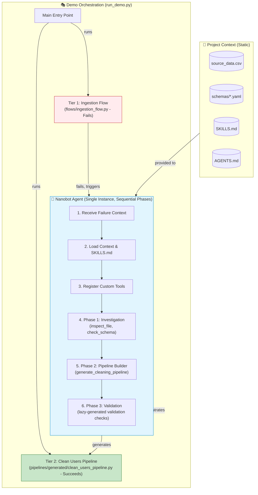
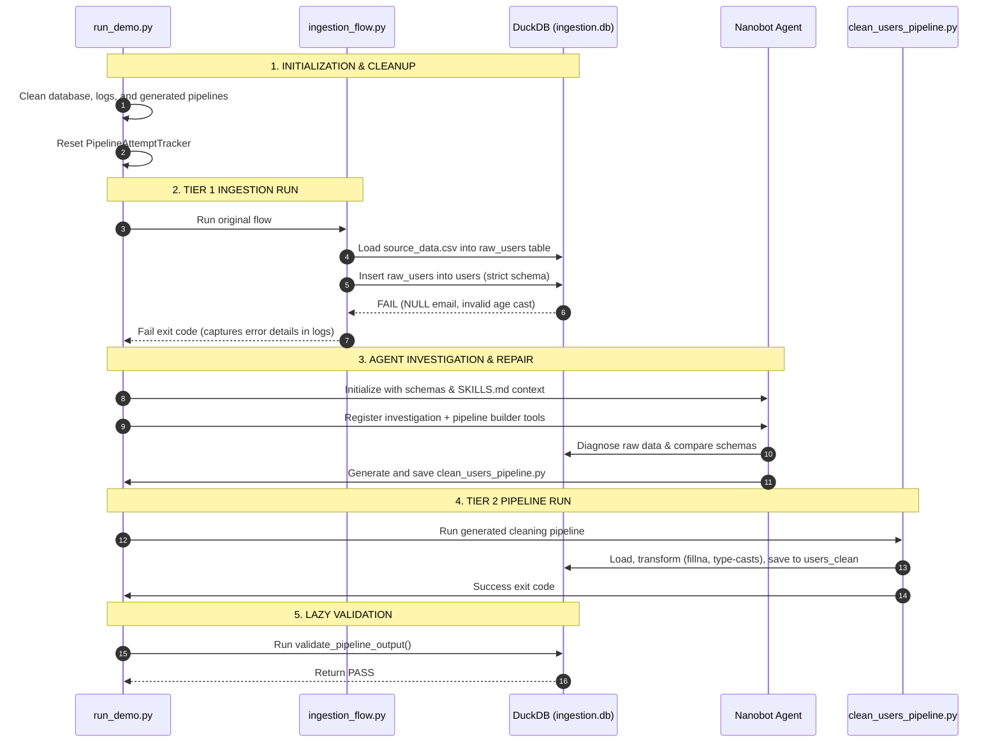

# Loops: Autonomous Data Ingestion Troubleshooting System

[](https://github.com)
[](https://python.org)
[](https://prefect.io)
[](https://modelcontextprotocol.io)

**Loops** is a **proof-of-concept** demonstrating how AI agents can autonomously detect, diagnose, and fix data quality issues in ETL pipelines. It showcases a complete workflow where:

1. ❌ A data ingestion pipeline **fails** due to data quality issues (NULL values, type mismatches, malformed data)
2. 🔍 An AI agent (Nanobot) **investigates** the failure using custom tools
3. 🏗️ The agent **generates** cleaning pipelines automatically with Prefect decorators
4. ✅ The generated pipelines **succeed**, fixing the data issues with hybrid Prefect/sync execution

This demonstrates a practical pattern for **self-healing data pipelines** that can operate with or without a Prefect server.

---

## 🎯 What This Proof of Concept Demonstrates

This project proves that AI agents can:
- **Autonomously troubleshoot** complex data pipeline failures
- **Generate production-ready code** that fixes data quality issues
- **Work with hybrid orchestration** (Prefect decorators + sync fallback)
- **Validate their own work** with lazy-generated validation checks
- **Maintain context continuity** using a single agent with sequential phases

Perfect for teams looking to add autonomous data quality remediation to their ETL workflows.

---

## 🚀 System Architecture Overview

The system operates on a multi-tier structure designed to show a clear progression from ingestion failure to autonomous agent-driven recovery:



---

## 🔴 Critical Architecture & Implementation Patterns

### 1. Hybrid Prefect/Sync Pipelines
All generated pipelines use Prefect 3.7+ decorators but are written to run as a standalone script without requiring a Prefect server. 
- **Implementation**: The script checks if `PREFECT_API_KEY` or `PREFECT_EPHEMERAL_START` is set.
- **Graceful Fallback**: If no Prefect server is available, it maps dummy `@flow` and `@task` decorators so the ETL runs as a standard synchronous Python script.
- **Template Source**: Managed in [agents/pipeline_builder/flow_template_prefect_v3.txt](agents/pipeline_builder/flow_template_prefect_v3.txt).

### 2. Why Two Different Pipeline Types?

| Aspect | Tier 1: Prefect Flow (Demo) | Tier 2: Hybrid Cleaning Pipeline (Generated) |
|--------|----------------------------|---------------------------------------------|
| **Purpose** | Demonstration (show failure) | Solution (clean and fix data) |
| **Complexity** | Prefect orchestration flow | Prefect decorators + sync fallback |
| **Dependencies** | Prefect library required | Prefect optional (sync mode works without server) |
| **Error Handling** | Standard failure exit codes | Try/except with default schema values fallback |
| **Use Case** | Multi-step workflows | Auto-generated data cleaning |
| **File Location** | [flows/ingestion_flow.py](flows/ingestion_flow.py) | [pipelines/generated/clean_users_pipeline.py](pipelines/generated/clean_users_pipeline.py) |

### 3. Pipeline-Aware Validation (Lazy Check Generation)
Instead of pre-generating hardcoded tests during pipeline compilation, validation uses a lazy generation pattern:
- **Implementation**: The pipeline uses the validation module in [agents/validation_agent.py](agents/validation_agent.py) and feeds it the source metadata.
- **Dynamic Check Compilation**: The validation agent evaluates column counts, null statistics, type correctness, and limits on-demand, and caches the rules in [validation checks JSON files](pipelines/validation/users_validation_checks.json).

### 4. Pipeline Attempt Tracker & Circuit Breakers
To prevent infinite loops of regeneration and execution during automated pipeline attempts, the system relies on [utils/limits.py](utils/limits.py).
- **Execution Limits**: Configured in `config/limits.yaml` (default: max 3 regenerations, max 2 executions per pipeline).
- **Exponential Backoff**: Applies delay between repeated failures.
- **Circuit Breaker**: Stops the bot from invoking models if limits are breached.

---

## 🤖 The Nanobot Agent Architecture

The core of the troubleshooting capability is built around a **Single Nanobot Agent Instance** performing multiple roles in sequential phases. This maintains context continuity and avoids overhead from spawning multiple separate LLM agents.

### Agent Phases

#### 🔍 Phase 1: Investigation
- **Purpose**: Programmatically analyze failures.
- **Workflow**: 
  1. Inspect the error logs (`logs/ingestion.log`) to identify failure symptoms.
  2. Inspect raw data files (`data/source_data.csv`) using [flows/nanobot_tools.py](flows/nanobot_tools.py).
  3. Query the raw staging table in DuckDB using `query_duckdb`.
  4. Compare the data structure with the ideal schema definitions ([schemas/users_schema.yaml](schemas/users_schema.yaml)) using the validation tools.
- **Outcome**: A detailed diagnostic report explaining why the ingestion pipeline failed (e.g., NULL values in mandatory fields, string types in integer columns).

#### 🛠️ Phase 2: Pipeline Generation (Pipeline Builder)
- **Purpose**: Write an auto-generated cleaning pipeline.
- **Workflow**:
  1. Load the target YAML schema using `load_ideal_schema`.
  2. Infer the schema of the source file using `infer_source_schema`.
  3. Map differences between the source and destination schemas using `compare_schemas`.
  4. Generate code using [agents/pipeline_builder/tools.py](agents/pipeline_builder/tools.py), translating mismatches into specific pandas transformation rules.
- **Outcome**: A complete pipeline saved at [pipelines/generated/clean_users_pipeline.py](pipelines/generated/clean_users_pipeline.py).

#### 🧪 Phase 3: Validation
- **Purpose**: Verify that the cleaned data complies with the target schema rules.
- **Workflow**: 
  1. Run the generated pipeline to write clean data to DuckDB.
  2. Leverage the validator in [agents/validation_agent.py](agents/validation_agent.py) to run schema checks against the output database.
- **Outcome**: A validation audit cached in the `pipelines/validation/` directory.

---

## 🔄 The Demo Lifecycle (`run_demo.py`)

[run_demo.py](run_demo.py) is the entry point that runs the complete lifecycle:



### Detailed Lifecycle Steps

1. **Cleanup and Initialization**: The demo clears any previous databases (`data/ingestion.db`), log files, and generated pipelines. The attempt tracker is reset.
2. **Tier 1 - Running the Ingest Flow**: The demo triggers [flows/ingestion_flow.py](flows/ingestion_flow.py). This flow loads `data/source_data.csv` into a staging table, then tries to insert it into the strict `users` table. It fails intentionally because:
   - Several rows contain empty/NULL email values (`email` has a `NOT NULL` constraint).
   - Some age entries contain invalid formats (e.g., `'N/A'`), violating integer type constraints.
3. **Triggering Nanobot Investigation**:
   - The orchestrator loads custom tools from [flows/nanobot_tool_classes.py](flows/nanobot_tool_classes.py) and [agents/pipeline_builder/nanobot_tools.py](agents/pipeline_builder/nanobot_tools.py) into the Nanobot registry.
   - The agent is prompted programmatically with the file paths and target schemas.
   - **Fallback**: If no API key is available or the agent encounters an error, the demo gracefully falls back to `run_pipeline_builder_demo` in [run_demo.py](run_demo.py), executing deterministic schema comparisons to generate the pipeline code.
4. **Execution & Validation**: The newly generated pipeline is run. Once complete, [agents/validation_agent.py](agents/validation_agent.py) performs lazy verification, confirming the final table is fully clean.
5. **Subsequent Runs**: When [run_demo.py](run_demo.py) is invoked again, it detects that the generated cleaning pipeline already exists, runs it directly, and succeeds.

---

## ⚠️ Intentional Errors in Source Data

The `data/source_data.csv` file contains several intentional data quality issues that cause the **Prefect** ingestion flow to fail:

| Row | Column | Issue | Error Type |
|-----|--------|-------|------------|
| 6 | email | Empty/NULL value | `NOT NULL` constraint violation |
| 7 | age | `"N/A"` | Type conversion error (`STRING` to `INTEGER`) |
| 11 | email | `"karen@example"` | Invalid format (missing TLD) |

These issues cause the **Prefect ingestion flow** to fail with:
- `ConversionException: Could not convert string 'N/A' to INT32`
- `NOT NULL constraint failed: users.email`

The **hybrid Prefect/sync cleaning flows** handle these issues by:
- Using `pd.to_numeric(..., errors='coerce').fillna(default)` for type conversions in `@task` functions.
- Using `df['column'].fillna(default)` for NULL values.
- Applying schema-conformant validation rules prior to writing.

---

## 🗄️ Database Schema Details

### 1. `raw_users` (Staging Table - Created by Prefect Flow)
This table acts as a landing zone and retains all raw inputs as strings:
```sql
CREATE TABLE raw_users (
    id VARCHAR,
    name VARCHAR,
    email VARCHAR,
    age VARCHAR,
    join_date VARCHAR,
    status VARCHAR,
    score VARCHAR
);
```

### 2. `users` (Target Table - Strict Constraints, Will Fail)
This is the target table that the initial Prefect flow fails to load due to strict constraints:
```sql
CREATE TABLE users (
    id INTEGER NOT NULL,
    name VARCHAR NOT NULL,
    email VARCHAR NOT NULL,
    age INTEGER NOT NULL,
    join_date DATE NOT NULL,
    status VARCHAR NOT NULL,
    score FLOAT NOT NULL,
    created_at TIMESTAMP DEFAULT CURRENT_TIMESTAMP,
    PRIMARY KEY (id)
);
```

### 3. `users_clean` (Cleaned Table - Created by Generated Pipeline)
This is the final target table populated by the auto-generated hybrid cleaning pipeline:
```sql
CREATE TABLE users_clean (
    id INTEGER,
    name VARCHAR,
    email VARCHAR,
    age INTEGER,
    join_date DATE,
    status VARCHAR,
    score FLOAT
);
```

---

## 🛠️ Environment Setup & Quick Start

### Prerequisites
- Python 3.11+
- Virtual environment tool
- OpenAI API Key

### Installation
1. Clone the repository and navigate to the project directory:
   ```bash
   cd loops
   ```
2. Activate your virtual environment and install the required dependencies:
   ```bash
   python -m venv venv
   source venv/bin/activate
   pip install -r requirements.txt
   ```

### Configuration
Create a `.env` file in the root directory:
```bash
OPENAI_API_KEY="your-api-key-here"
OPENAI_MODEL="gpt-4o-mini" # Optional
```

### Running the Orchestrated Demo
Execute the primary entry point:
```bash
python run_demo.py
```

### Running Individual Components Manually
```bash
# 1. Run the failing Prefect ingestion flow
python flows/ingestion_flow.py

# 2. Run the standalone pipeline builder (fallback mode)
python scripts/demo_pipeline_builder.py

# 3. Run the generated hybrid cleaning pipeline
python pipelines/generated/clean_users_pipeline.py

# 4. Start Nanobot server for API interactions
python -m nanobot.server --config config/nanobot_config.yaml --log-level DEBUG

# 5. Start the MCP server
python flows/mcp_server.py --host 127.0.0.1 --port 8081
```

---

## 📁 Directory Structure

```
loops/
├── agents/                          # Autonomous agent components
│   └── pipeline_builder/            # Pipeline Generation (Phase 2)
│       ├── tools.py                 # Schema analysis & pipeline generation
│       ├── nanobot_tools.py         # Nanobot-compatible tool classes
│       ├── config.json              # Pipeline builder configuration
│       └── flow_template_prefect_v3.txt  # Hybrid pipeline template
│   └── validation_agent.py          # Post-execution validation (Phase 3)
├── config/                          # Configuration files
│   ├── nanobot_config.yaml          # Nanobot server configuration
│   ├── nanobot_config_minimal.json  # Minimal config for demo
│   └── nanobot_logging.yaml         # Logging configuration
├── data/                            # Data files
│   ├── source_data.csv              # Source CSV with intentional errors
│   ├── orders.csv                  # Orders data
│   ├── transactions.csv            # Transactions data
│   └── ingestion.db                # DuckDB database (created on first run)
├── flows/                           # Main flows and tools
│   ├── ingestion_flow.py           # Tier 1: Prefect flow that fails (Demo)
│   ├── nanobot_tools.py            # Investigation tools (Phase 1)
│   ├── nanobot_tool_classes.py     # Class-based tools
│   └── mcp_server.py               # Optional MCP server
├── pipelines/                       # Generated output
│   ├── generated/                   # Auto-generated hybrid pipelines (Tier 2)
│   │   ├── clean_users_pipeline.py
│   │   ├── clean_orders_pipeline.py
│   │   └── clean_transactions_pipeline.py
│   └── validation/                  # Validation check caches
├── schemas/                         # Schema definitions
│   ├── users_schema.yaml           # Users table schema
│   ├── orders_schema.yaml          # Orders table schema
│   └── transactions_schema.yaml    # Transactions table schema
├── utils/                           # Shared utilities
│   ├── limits.py                   # Pipeline attempt tracking & circuit breakers
│   ├── paths.py                    # Centralized path management
│   ├── cleanup.py                  # Cleanup utilities
│   └── validation.py               # Validation check generators
├── Dockerfile                       # Docker image configuration
├── docker-compose.yml               # Docker Compose configuration
├── .dockerignore                    # Files excluded from Docker image
├── scripts/                         # Utility and demo scripts
│   ├── docker/                      # Docker management scripts
│   │   ├── docker-run.sh            # Start demo in Docker
│   │   ├── docker-stop.sh           # Stop Docker container
│   │   └── docker-clean.sh          # Clean up and start fresh
│   ├── demo_pipeline_builder.py     # Standalone pipeline builder demo
│   ├── demo_mcp_tools.py            # MCP tools validation demo
│   └── validate_with_mcp.py         # Direct MCP validation demo
├── run_demo.py                       # Main entry point (orchestrates all stages)
├── docs/                            # Documentation
│   ├── SKILLS.md                    # Master skills index
│   └── ARCHITECTURE.md               # System architecture documentation
├── AGENTS.md                        # Instructions for AI agents
└── .env                            # Environment variables (OPENAI_API_KEY)
```

---

## 🧪 Testing Suite

The repository contains a suite of **106 unit and integration tests** verifying tool registry, limits, validation generation, MCP endpoints, and pipeline tools with Nanobot integration.

To run the tests, ensure your virtual environment is active, or invoke using the venv python executable:

```bash
# Run all tests using venv python
venv/bin/python -m pytest -v
```

Run specific test suites:
- **Pipeline Builder**: `venv/bin/python -m pytest tests/test_pipeline_builder.py -v` (27 tests)
- **Pipeline Limits / Backoff**: `venv/bin/python -m pytest tests/test_limits.py -v` (32 tests)
- **MCP Server**: `venv/bin/python -m pytest tests/test_mcp_server.py -v` (20 tests)
- **Validation Agent**: `venv/bin/python -m pytest test_validation.py -v` (24 tests)
- **Nanobot Integration**: `venv/bin/python -m pytest tests/test_pipeline_tools_with_nanobot.py -v` (3 tests)

---

## 🐳 Docker Support

The project includes full Docker support with `docker-compose` for easy setup and development.

### Prerequisites
- Docker installed on your system
- Docker Compose (included with Docker Desktop)
- OpenAI API key in your `.env` file

### Quick Start with Docker

1. **Ensure your `.env` file has your OpenAI API key**:
   ```bash
   OPENAI_API_KEY=your-api-key-here
   OPENAI_MODEL=gpt-4.1-mini-2025-04-14
   ```

2. **Use the convenience scripts**:
   ```bash
   # Make scripts executable (one-time setup)
   chmod +x scripts/docker/docker-run.sh scripts/docker/docker-stop.sh scripts/docker/docker-clean.sh
   
   # Start the demo
   ./scripts/docker/docker-run.sh
   
   # Query the database (container stays running)
   docker-compose exec loops python3 -c "import duckdb; conn = duckdb.connect('data/ingestion.db'); print(conn.execute('SHOW TABLES').fetchall()); conn.close()"
   
   # Stop the container
   ./scripts/docker/docker-stop.sh
   
   # Clean up and start fresh
   ./scripts/docker/docker-clean.sh
   ```

### Manual Docker Commands

```bash
# Build the image and start the container
docker-compose up -d --build

# Execute the demo in the running container
docker-compose exec loops python run_demo.py

# View logs
docker-compose logs -f

# Open a shell in the container
docker-compose exec loops bash

# Stop the container
docker-compose down
```

### How It Works

The Docker setup uses UID/GID passing to ensure files created in mounted volumes are owned by you:
- The container runs with `tail -f /dev/null` as its CMD to keep it running
- `scripts/docker/docker-run.sh` uses `docker-compose exec` to run the demo inside the container
- This ensures only one instance of `run_demo.py` executes (no duplicate runs)
- No `sudo` required - all files are owned by your user

### Generated Tables

After running the demo, the DuckDB database (`data/ingestion.db`) contains:
- `raw_users` - Raw staging data (13 rows)
- `users` - Strict target table (0 rows - transform intentionally fails)
- `users_clean` - Cleaned user data (13 rows)
- `orders_clean` - Cleaned orders data (13 rows)
- `transactions_clean` - Cleaned transactions data (13 rows)

---

## 🎯 Quick Proof of Concept Demo

Want to see it in action? Here's the fastest way:

```bash
# 1. Clone and setup (assuming you have Docker and an OpenAI API key)
cd loops
echo "OPENAI_API_KEY=your-key-here" > .env
echo "OPENAI_MODEL=gpt-4o-mini" >> .env
chmod +x scripts/docker/docker-run.sh scripts/docker/docker-stop.sh scripts/docker/docker-clean.sh

# 2. Run the demo (takes 2-3 minutes)
./scripts/docker/docker-run.sh

# 3. Verify the results - all tables should be created
docker-compose exec loops python3 -c "
import duckdb
conn = duckdb.connect('data/ingestion.db')
for table, in conn.execute('SHOW TABLES').fetchall():
    count = conn.execute(f'SELECT COUNT(*) FROM {table[0]}').fetchone()[0]
    print(f'{table[0]}: {count} rows')
conn.close()
"
```

**Expected output:**
```
orders_clean: 13 rows
raw_users: 13 rows
transactions_clean: 13 rows
users: 0 rows (intentional - transform fails)
users_clean: 13 rows (cleaned by AI-generated pipeline!)
```

The demo shows:
- ✅ Intentional failure in Tier 1 (ingestion flow)
- ✅ AI agent investigation and diagnosis
- ✅ Automatic generation of cleaning pipelines
- ✅ Successful execution with all data cleaned
- ✅ Container stays running for database inspection

---

## 🚀 Production Deployment Considerations

For production environments, consider the following enhancements:
1. **Mock Alerts**: Replace the mock Slack alert in [flows/nanobot_tools.py](flows/nanobot_tools.py) with a real webhook handler.
2. **MCP Security**: Secure the MCP server endpoints using access control lists and authentication tokens.
3. **Database Guardrails**: Implement query timeouts and read-only connection limits for database inspection tools.
4. **Log Rotation**: Configure robust log-rotate patterns for the `logs/` directory to prevent resource consumption.
5. **Prefect Deployment**: Register the generated pipelines as formal Prefect Deployments scheduled on active Prefect Work Pools.

---

## 📚 Learn More

- **[AGENTS.md](AGENTS.md)** - Detailed instructions for AI agents working with this codebase
- **[SKILLS.md](SKILLS.md)** - Master skills index and workflow overview
- **[ARCHITECTURE.md](ARCHITECTURE.md)** - Detailed architecture diagrams and explanations
