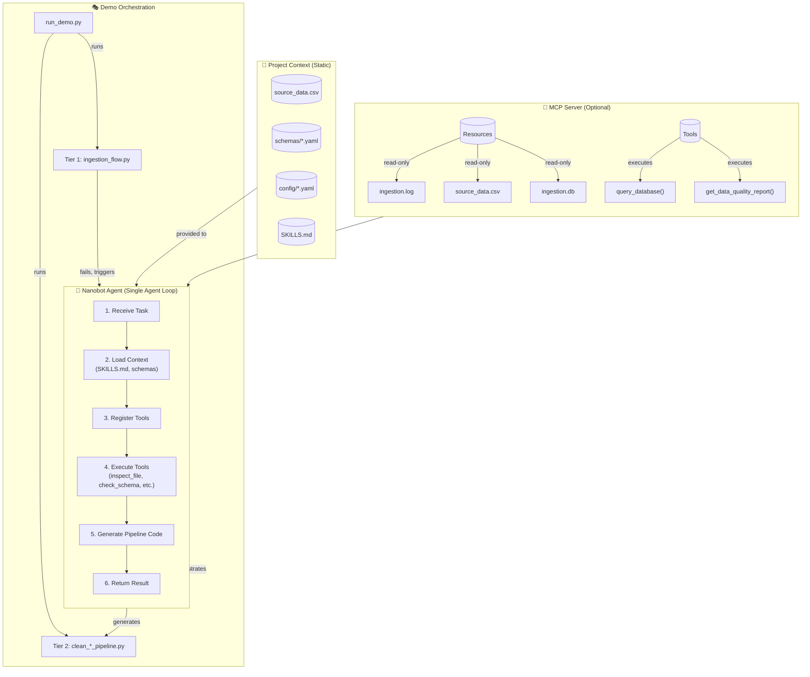
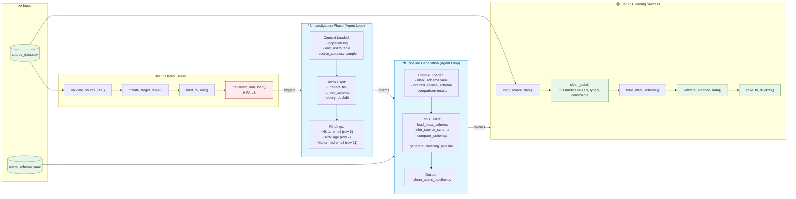

# Data Ingestion Troubleshooting with Nanobot

[](https://github.com)
[](https://python.org)
[](https://prefect.io)
[](https://modelcontextprotocol.io)

An **autonomous AI agent system** for diagnosing and automatically fixing data ingestion failures. This proof-of-concept demonstrates a complete workflow where an AI agent (Nanobot) detects, investigates, and resolves data quality issues using a **hybrid Prefect/pipeline architecture**.

## Overview

This project showcases:

1. **Intentional Data Errors**: A **Prefect** ingestion flow that fails due to data quality issues (NULL values, type mismatches, malformed data)
2. **Autonomous Investigation**: A Nanobot agent that automatically troubleshoots failures using custom tools
3. **Automatic Pipeline Generation**: AI-powered pipeline builder that generates **hybrid Prefect/sync cleaning pipelines** with Prefect decorators to fix data issues
4. **Schema Validation**: Automatic comparison of source data against ideal schemas
5. **Self-Healing**: The system can generate and execute cleaning pipelines to resolve ingestion failures
6. **Comprehensive Testing**: 103 tests covering all components with 100% pass rate

### Key Technologies

- **nanobot-ai**: Autonomous AI agent framework with tool integration (PyPI: `nanobot-ai`)
- **DuckDB**: Embedded analytical database for data processing
- **Prefect 3.7+**: Workflow orchestration (generated pipelines use Prefect decorators with sync fallback)
- **Pandas**: Data manipulation library
- **OpenAI API**: LLM-powered investigation and code generation
- **MCP Server**: Model Context Protocol for enhanced agent capabilities (optional)

---

## Architecture: Hybrid Pipeline Model

For detailed architecture diagrams (Levels 3-5), see [ARCHITECTURE.md](ARCHITECTURE.md) which includes:
- Pipeline generation workflow with agent context
- Component interaction sequence diagrams
- Individual pipeline structure
- Agent context flow and lifecycle
- MCP server integration details
- Error handling and retry logic

This project uses a **two-tier pipeline architecture** with **agentic loops** for autonomous troubleshooting.

### Tier 1: Prefect Orchestration Flow (DEMO ONLY)
- **File**: `flows/ingestion_flow.py`
- **Purpose**: Demonstrates the **failure** - intentionally has strict schema that causes errors
- **Type**: Full Prefect flow with `@flow` and `@task` decorators
- **Status**: Will fail due to data quality issues

### Tier 2: Hybrid Prefect/Sync Cleaning Pipelines (AUTO-GENERATED)
- **Files**: `pipelines/generated/clean_*.py`
- **Purpose**: **Fixes** the data quality issues
- **Type**: Prefect flows with `@flow` and `@task` decorators (falls back to sync mode if no Prefect server)
- **Status**: Succeeds by applying type conversions, NULL handling, and constraint enforcement

### Level 1: System Overview with Agent Loops



### Level 2: Data Flow with Context History



### Why Two Different Pipeline Types?

| Aspect | Prefect Flow (Demo) | Hybrid Pipeline (Cleaning) |
|--------|---------------------|---------------------------|
| **Purpose** | Demonstration (show failure) | Solution (fix data) |
| **Complexity** | Prefect orchestration | Prefect decorators + sync fallback |
| **Dependencies** | Prefect library | Prefect optional (sync mode works without server) |
| **Error Handling** | Built-in retry, logging | Try/except with error handling |
| **Use Case** | Multi-step workflows | Auto-generated data cleaning |

The demo uses **Prefect orchestration**, while the generated cleaning pipelines use **Prefect decorators with graceful fallback to synchronous execution** when no Prefect server is available. This provides:
1. Consistent Prefect decorators for future orchestration readiness
2. Graceful degradation - works without a Prefect server
3. Automatic server detection for full orchestration when available
4. Unified code structure across all generated pipelines

---

## Project Structure

```
loops/
├── agents/
│   └── pipeline_builder/
│       ├── tools.py           # Schema analysis & pipeline generation tools
│       ├── nanobot_tools.py   # Nanobot-compatible tool classes
│       ├── config.json        # Pipeline builder configuration
│       └── skills.md          # Pipeline builder specific skills (Stage 2)
├── config/
│   ├── nanobot_config.yaml    # Full Nanobot server configuration
│   ├── nanobot_config_minimal.json  # Minimal config for demo
│   └── nanobot_logging.yaml   # Logging configuration
├── data/
│   ├── source_data.csv       # Source CSV with intentional errors
│   ├── orders.csv            # Orders data (optional)
│   ├── transactions.csv      # Transactions data (optional)
│   └── ingestion.db          # DuckDB database (created on first run)
├── flows/
│   ├── ingestion_flow.py     # Prefect flow that fails on bad data (Tier 1)
│   ├── nanobot_tools.py      # Investigation tools for Nanobot
│   ├── mcp_server.py         # MCP server for enhanced capabilities
│   ├── investigation_skills.md # Stage 1: Investigation agent skills
│   └── validation_skills.md   # Stage 3: Validation agent skills
├── pipelines/
│   └── generated/            # Auto-generated hybrid Prefect/sync cleaning pipelines (Tier 2)
│       ├── clean_users_pipeline.py
│       ├── clean_transactions_pipeline.py
│       └── clean_orders_pipeline.py
├── schemas/
│   ├── users_schema.yaml     # Ideal schema for users data
│   ├── orders_schema.yaml    # Schema for orders data
│   └── transactions_schema.yaml  # Schema for transactions data
├── skills/
│   ├── __init__.py           # SkillLoader class for loading skills
│   └── utils.py              # Utility functions for agent context
├── logs/
│   ├── ingestion.log         # Ingestion pipeline logs
│   ├── prefect.log           # Prefect flow logs
│   └── nanobot.log           # Nanobot investigation logs
├── sessions/
│   └── *.jsonl              # Session files
├── run_demo.py               # Main demo entry point (orchestrates all stages)
├── demo_pipeline_builder.py # Standalone pipeline builder demo
├── SKILLS.md                # Master skills index for all stages
├── AGENTS.md               # Instructions for AI agents working with this repo
├── README.md                # This file
└── .env                    # Environment variables (OPENAI_API_KEY)
```

---

## Intentional Errors in Source Data

The `data/source_data.csv` file contains several intentional data quality issues that cause the **Prefect** ingestion flow to fail:

| Row | Column | Issue | Error Type |
|-----|--------|-------|------------|
| 6 | email | Empty/NULL value | NOT NULL constraint violation |
| 7 | age | "N/A" | Type conversion error (STRING to INTEGER) |
| 11 | email | "karen@example" | Invalid format (missing TLD) |

These issues cause the **Prefect ingestion flow** to fail with:
- `ConversionException: Could not convert string 'N/A' to INT32`
- `NOT NULL constraint failed: users.email`

The **hybrid Prefect/sync cleaning flows** handle these issues by:
- Using `pd.to_numeric(..., errors='coerce').fillna(default)` for type conversions in @task functions
- Using `df['column'].fillna(default)` for NULL values in @task functions
- Using proper validation before loading in @task functions

---

## Quick Start

### Prerequisites

- Python 3.11+ (required by nanobot-ai and pandas 3.x)
- Virtual environment (recommended)
- OpenAI API key (required for Nanobot LLM access)

### Setup

```bash
# Clone or navigate to the project
   cd /path/to/your/loops

# Create and activate virtual environment
python -m venv venv
source venv/bin/activate  # Linux/Mac
# OR: venv\Scripts\activate  # Windows

# Install dependencies (from requirements.txt)
pip install -r requirements.txt

# Or install individually
pip install nanobot-ai prefect>=3.7.0 duckdb>=1.5.0 mcp>=1.28.0 pandas python-dotenv

# Set your OpenAI API key (required)
export OPENAI_API_KEY="your-api-key-here"

# Optional: Set model (default: gpt-4o-mini)
export OPENAI_MODEL="gpt-4o-mini"
```

### Run the Complete Demo

```bash
# Run the full demo - this will:
# 1. Run the Prefect ingestion flow (it will fail)
# 2. Test investigation tools
# 3. Trigger Nanobot to analyze and fix the issues
# 4. Generate hybrid Prefect/sync cleaning pipelines
# 5. Execute the generated hybrid pipelines to verify the fix
python run_demo.py
```

The demo will:
1. **Prefect flow fails** (expected) due to data errors
2. Nanobot investigates using the tools in `flows/nanobot_tools.py`
3. Pipeline builder generates **hybrid cleaning pipelines** with Prefect decorators in `pipelines/generated/`
4. Generated **hybrid pipelines** are executed (sync mode by default) and succeed

### Run Individual Components

```bash
# Step 1: Run the failing Prefect ingestion (creates errors)
python flows/ingestion_flow.py

# Step 2: Run the pipeline builder to generate hybrid Prefect/sync fixes
python demo_pipeline_builder.py

# Step 3: Run the generated hybrid cleaning pipeline (works with or without Prefect server)
python pipelines/generated/clean_users_pipeline.py

# Step 4: Start Nanobot server for manual investigation
python -m nanobot.server --config config/nanobot_config.yaml --log-level DEBUG

# Step 5: Start MCP server (optional)
python flows/mcp_server.py --host 127.0.0.1 --port 8081
```

---

## Architecture

### Workflow Overview

```
┌─────────────────────────────────────────────────────────────┐
│                      run_demo.py (Entry Point)                  │
└─────────────────────────────────────────────────────────────┘
                                    │
                                    ▼
┌─────────────────────────────────────────────────────────────┐
│            TIER 1: PREFECT FLOW (Demonstration)                │
│                 flows/ingestion_flow.py                         │
│  ┌─────────────┐    ┌─────────────┐    ┌─────────────────────┐  │
│  │ validate     │───▶│ create       │───▶│ transform_and_load   │  │
│  │ source_file  │    │ target_table │    │ (INTENTIONALLY FAILS)│  │
│  └─────────────┘    └─────────────┘    └─────────────────────┘  │
│                              │                                  │
│                              ▼                                  ▼
│                    raw_users table         users table (FAILS)  │
└─────────────────────────────────────────────────────────────┘
                                    │
                                    ▼
┌─────────────────────────────────────────────────────────────┐
│              Investigation Phase (run_demo.py)                  │
│  ┌─────────────────┐    ┌─────────────────────────────────┐  │
│  │ Test Tools:      │    │ Trigger Nanobot Investigation     │  │
│  │ - inspect_file   │    │ - Uses tools from nanobot_tools  │  │
│  │ - check_schema   │    │ - Analyzes logs, DB, source data  │  │
│  │ - get_ingestion  │    │ - Identifies need for cleaning   │  │
│  │   _status        │    │                                   │  │
│  └─────────────────┘    └─────────────────────────────────┘  │
└─────────────────────────────────────────────────────────────┘
                                    │
                                    ▼
┌─────────────────────────────────────────────────────────────┐
│           Pipeline Builder (agents/pipeline_builder/)          │
│  ┌─────────────────┐    ┌─────────────────────────────────┐  │
│  │ Tools:           │    │ generate_cleaning_pipeline()      │  │
│  │ - load_ideal_    │───▶│ - Compares source vs ideal       │  │
│  │   schema        │    │ - Generates hybrid Prefect/sync flow code    │  │
│  │ - infer_source_  │    │ - Handles type casting, NULLs   │  │
│  │   schema        │    │ - Saves to pipelines/generated  │  │
│  │ - compare_      │    │                                   │  │
│  │   schemas       │    │                                   │  │
│  └─────────────────┘    └─────────────────────────────────┘  │
└─────────────────────────────────────────────────────────────┘
                                    │
                                    ▼
┌─────────────────────────────────────────────────────────────┐
│            TIER 2: HYBRID PREFECT/SYNC CLEANING PIPELINE       │
│          pipelines/generated/clean_users_pipeline.py           │
│  - Loads source data with pandas (@task decorators)          │
│  - Applies type conversions with fillna fallback              │
│  - Fills NULL values with schema defaults                      │
│  - Inserts cleaned data into DuckDB                            │
│  - Works with Prefect server or sync fallback                   │
└─────────────────────────────────────────────────────────────┘
```

### Data Flow

```
Source CSV → [Prefect Flow] → raw_users (staging) → [FAILS]
                         ↓
                  [Nanobot investigates]
                         ↓
                  [Pipeline Builder generates Hybrid flows]
                         ↓
                  [Hybrid Flow] → users_clean (fixed)
```

---

## Using Nanobot Programmatically

### Basic Investigation

```python
from nanobot import Nanobot
import os

# Set API key
os.environ["OPENAI_API_KEY"] = "your-api-key"

# Create bot with config
bot = Nanobot.from_config(
    config_path="config/nanobot_config_minimal.json",
    model="gpt-4o-mini"
)

# Register custom tools
from flows.nanobot_tools import NANOBOT_TOOLS
for tool_name, tool_config in NANOBOT_TOOLS.items():
    bot.register_tool(
        name=tool_name,
        description=tool_config["description"],
        func=tool_config["function"]
    )

# Trigger investigation
result = bot.run("Investigate the failed data ingestion and identify all issues.")
print(result)
```

### With Pipeline Builder Tools

```python
from nanobot import Nanobot
from agents.pipeline_builder.nanobot_tools import PIPELINE_TOOL_CLASSES
import os

os.environ["OPENAI_API_KEY"] = "your-api-key"

# Create bot
bot = Nanobot.from_config(
    config_path="config/nanobot_config_minimal.json",
    model="gpt-4o-mini"
)

# Register pipeline builder tools
for tool_class in PIPELINE_TOOL_CLASSES:
    tool_instance = tool_class()
    bot.register_tool(tool_instance)

# Trigger pipeline generation (generates hybrid Prefect/sync flows)
result = bot.run("""
    Investigate the failed data ingestion. 
    Use: infer_source_schema, load_ideal_schema, compare_schemas, 
    generate_cleaning_pipeline. 
    Save pipeline to pipelines/generated/clean_users_pipeline.py using write_file.
""")
```

---

## Available Tools

### Investigation Tools (`flows/nanobot_tools.py`)

| Tool | Description | Parameters |
|------|-------------|------------|
| `read_logs` | Read application logs to find error details | `path`, `tail_n=100` |
| `query_duckdb` | Execute SQL queries against DuckDB | `query` |
| `inspect_file` | Inspect source data files for metadata and samples | `path`, `sample_size=10` |
| `check_schema` | Validate data against expected schema | `path`, `schema` |
| `send_slack_alert` | Send investigation results to Slack (mock) | `message`, `severity` |
| `get_ingestion_status` | Get current status of the ingestion pipeline | None |

### Pipeline Builder Tools (`agents/pipeline_builder/tools.py`)

These tools generate **hybrid pipelines** for data cleaning:

| Tool | Description | Output |
|------|-------------|--------|
| `load_ideal_schema` | Load ideal schema definition from YAML | Schema dictionary |
| `infer_source_schema` | Infer schema from source CSV file | Inferred schema |
| `compare_schemas` | Compare source and ideal schemas | Comparison with mismatches |
| `generate_cleaning_pipeline` | Generate **hybrid pipeline** with Prefect decorators | Python code with @flow/@task decorators |

---

## Expected Investigation Flow

When the agent is triggered, it follows this protocol:

1. **Check Logs**: Use `read_logs` to get error messages from `logs/ingestion.log`
2. **Inspect Source**: Use `inspect_file` on `data/source_data.csv`
3. **Query Database**: Use `query_duckdb` to check `raw_users` table state
4. **Validate Schema**: Use `check_schema` to identify data quality issues
5. **Analyze Findings**: Identify root causes and impact
6. **Generate Fix**: Use Pipeline Builder to create **hybrid cleaning pipeline** with Prefect decorators
7. **Send Alert**: Use `send_slack_alert` to notify team

### Expected Findings

The agent should identify:

1. **Primary Failure**: `ConversionException: Could not convert string 'N/A' to INT32` for the `age` column
2. **Additional Issues**:
   - Row 6: Empty email value (NULL constraint violation)
   - Row 7: Age is 'N/A' instead of a number (type mismatch)
   - Row 11: Malformed email ('karen@example' missing TLD)
3. **Root Cause**: Source CSV contains data that doesn't match target schema constraints
4. **Recommended Actions**:
   - Generate **hybrid Prefect/sync cleaning flow** using Pipeline Builder
   - Apply COALESCE with CAST for type conversions
   - Fill NULL values with defaults from schema

---

## Configuration

### Nanobot Configuration

Edit `config/nanobot_config.yaml` to customize:

```yaml
agents:
  - name: "data_ingestion_investigator"
    model: "gpt-4o-mini"  # Change to your preferred model
    max_iterations: 20    # Prevent infinite loops
    temperature: 0.3       # Lower = more deterministic
    system_prompt: "..."  # Custom instructions
```

### Environment Variables

| Variable | Description | Required |
|----------|-------------|----------|
| `OPENAI_API_KEY` | OpenAI API key for LLM access | Yes |
| `OPENAI_MODEL` | Model to use (default: gpt-4o-mini) | No |
| `PYTHONPATH` | Should include project root | Set automatically |

Create a `.env` file:

```bash
OPENAI_API_KEY=your-api-key-here
OPENAI_MODEL=gpt-4o-mini
PYTHONPATH=/path/to/your/loops
```

---

## Database Schema

### `raw_users` (Staging Table - Created by Prefect Flow)

```sql
CREATE TABLE raw_users (
    id VARCHAR,
    name VARCHAR,
    email VARCHAR,
    age VARCHAR,
    join_date VARCHAR,
    status VARCHAR,
    score VARCHAR
)
```

### `users` (Target Table - Strict Constraints, Will Fail)

This is the table that the **Prefect flow** tries (and fails) to insert into:

```sql
CREATE TABLE users (
    id INTEGER NOT NULL,
    name VARCHAR NOT NULL,
    email VARCHAR NOT NULL,
    age INTEGER NOT NULL,
    join_date DATE NOT NULL,
    status VARCHAR NOT NULL,
    score FLOAT NOT NULL,
    created_at TIMESTAMP DEFAULT CURRENT_TIMESTAMP,
    PRIMARY KEY (id)
)
```

### `users_clean` (Cleaned Table - Created by Hybrid Prefect/Sync Cleaning Flow)

This is the table that the **generated hybrid Prefect/sync cleaning flow** successfully creates:

```sql
CREATE TABLE users_clean (
    id INTEGER,
    name VARCHAR,
    email VARCHAR,
    age INTEGER,
    join_date DATE,
    status VARCHAR,
    score FLOAT
)
```

---

## Testing

### Test Files

- `tests/test_pipeline_builder.py` - Tests for pipeline builder tools (27 tests)
- `tests/test_limits.py` - Tests for pipeline limits and attempt tracking (32 tests)
- `test_validation.py` - Tests for validation agent and checks (24 tests)
- `tests/test_mcp_server.py` - Tests for MCP server functionality (20 tests)

### Run Tests

```bash
# Run all tests (103 total)
python -m pytest -v

# Run specific test suites
python -m pytest tests/test_pipeline_builder.py -v  # Pipeline builder
python -m pytest tests/test_limits.py -v           # Limits/attempt tracking
python -m pytest tests/test_mcp_server.py -v        # MCP server
python -m pytest test_validation.py -v            # Validation

# Run with coverage
python -m pytest --cov=flows --cov=agents -v
```

---

## Production Deployment Considerations

For production use, consider:

1. **Replace mock Slack alert** with real Slack webhook integration
2. **Add authentication** to the MCP server
3. **Configure proper logging** rotation and retention
4. **Add monitoring** for agent health and performance
5. **Implement circuit breakers** to prevent infinite loops
6. **Add rate limiting** for database queries
7. **For full Prefect orchestration**: Start a Prefect server (optional - sync mode works without it)
8. Generated pipelines use Prefect decorators and work in both server and sync modes

---

## Troubleshooting

### Common Issues

| Issue | Solution |
|-------|----------|
| Nanobot can't connect to LLM | Verify `OPENAI_API_KEY` is set and valid |
| Database connection errors | Check `data/ingestion.db` exists and permissions |
| Prefect authentication errors | Set `PREFECT_API_KEY` or use local mode |
| Tools not found | Ensure `PYTHONPATH` includes project root |
| Module not found errors | Activate virtual environment and install dependencies |
| DuckDB CLI not accessible | Install duckdb package or add venv/bin to PATH |

### Debug Mode

For verbose output:

```bash
# Run demo with debug logging
export LOG_LEVEL=DEBUG
python run_demo.py

# Or edit config/nanobot_logging.yaml
log_level: DEBUG
```

---

## Files Summary

| File | Purpose | Type |
|------|---------|------|
| `run_demo.py` | Main entry point - runs complete demo workflow | Orchestrator |
| `demo_pipeline_builder.py` | Standalone pipeline builder demonstration | Utility |
| `flows/ingestion_flow.py` | Prefect flow that fails on bad data | Tier 1 - Demo |
| `flows/nanobot_tools.py` | Investigation tools for Nanobot | Tools |
| `flows/mcp_server.py` | MCP server for enhanced capabilities | Server |
| `flows/investigation_skills.md` | Stage 1: Investigation agent skills | Skills |
| `flows/validation_skills.md` | Stage 3: Validation agent skills | Skills |
| `agents/pipeline_builder/tools.py` | Pipeline generation logic | Tools |
| `agents/pipeline_builder/flow_template_prefect_v3.txt` | Prefect 3.x template with sync fallback | Template |
| `agents/pipeline_builder/nanobot_tools.py` | Nanobot tool classes for pipeline builder | Tools |
| `agents/pipeline_builder/config.json` | Pipeline builder configuration | Config |
| `agents/pipeline_builder/skills.md` | Stage 2: Pipeline builder skills | Skills |
| `schemas/*.yaml` | Schema definitions for each data type | Config |
| `config/nanobot_config.yaml` | Full Nanobot server configuration | Config |
| `config/nanobot_config_minimal.json` | Minimal config for demo | Config |
| `config/nanobot_logging.yaml` | Logging configuration | Config |
| `data/source_data.csv` | Source data with intentional errors | Data |
| `data/ingestion.db` | DuckDB database (auto-created) | Database |
| `pipelines/generated/*.py` | Hybrid cleaning pipelines with Prefect decorators (auto-generated) | Tier 2 - Solution |
| `SKILLS.md` | Master skills index for all stages | Documentation |
| `AGENTS.md` | Instructions for AI agents | Documentation |
| `.env` | Environment variables | Config |

---

## Related Documentation

- **SKILLS.md** - Master skills index and workflow overview
- **AGENTS.md** - Instructions and constraints for AI agents
- **agents/pipeline_builder/skills.md** - Pipeline builder specific skills
- **flows/investigation_skills.md** - Investigation agent skills
- **flows/validation_skills.md** - Validation agent skills
- **tests/README.md** - Test suite documentation (if available)

---

## Key Takeaway

This project demonstrates a **practical pattern** for self-healing data pipelines:

1. **Use Prefect** for demo flows to show orchestration capabilities
2. **Use Prefect decorators** for generated pipelines with graceful fallback to synchronous execution
3. **Let AI agents** detect failures and generate pipelines with Prefect decorators

The **generated cleaning pipelines use Prefect decorators** and automatically detect whether a Prefect server is available. They work in both server mode (full orchestration) and sync mode (local execution), providing maximum flexibility.

---

## License

MIT License - Feel free to use and adapt for your own projects.
