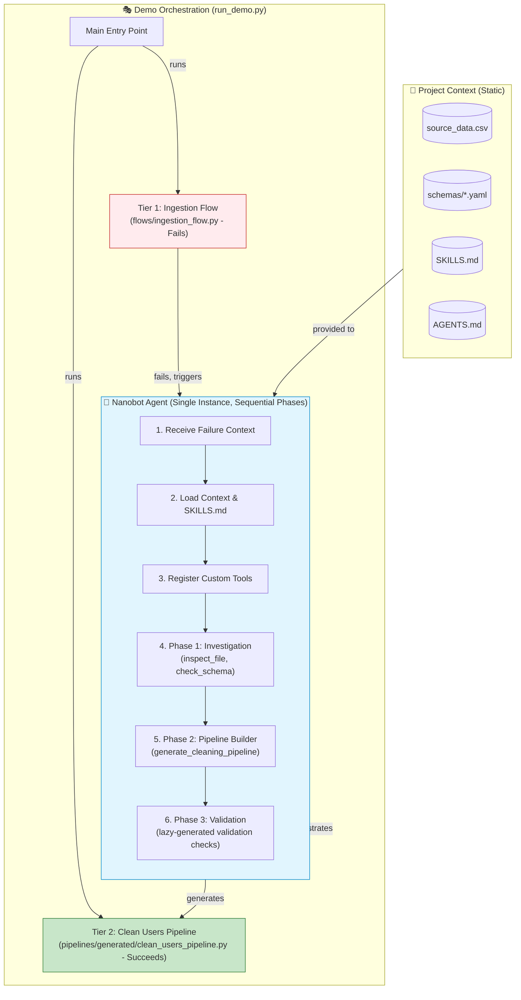
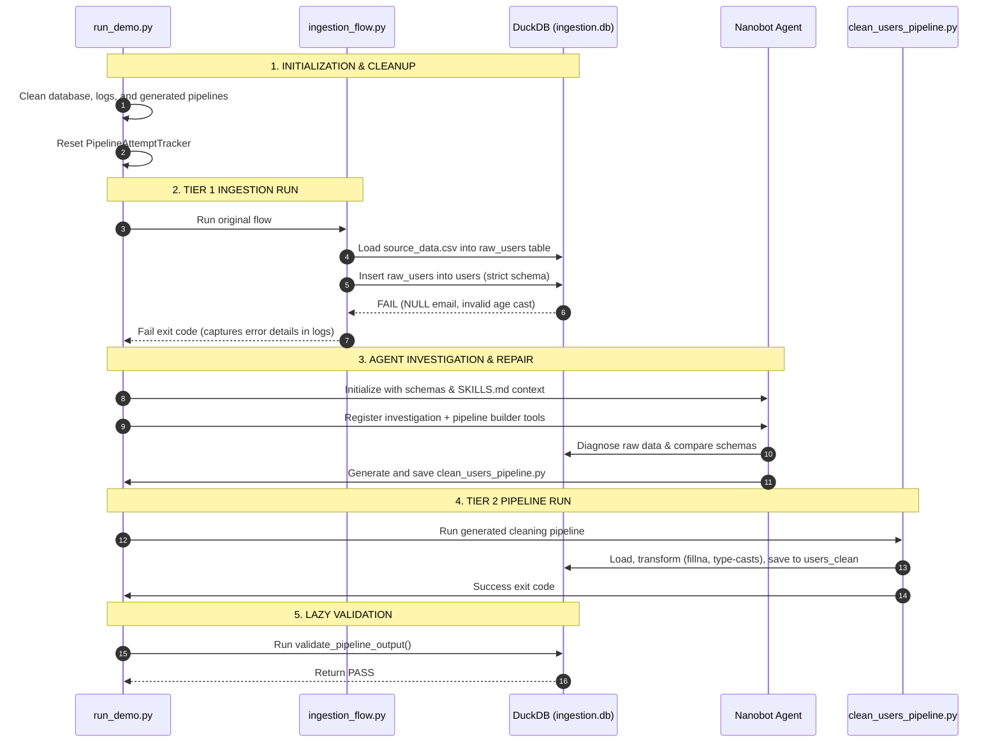

# Loops Data Ingestion System (README v2)

[](https://github.com)
[](https://python.org)
[](https://prefect.io)
[](https://modelcontextprotocol.io)

Welcome to the **Loops Data Ingestion System**—an autonomous data quality troubleshooting framework. This project demonstrates how an agentic loop powered by **Nanobot** can dynamically diagnose data quality failures in ETL pipelines, generate robust cleaning code, and execute/validate the results using a hybrid orchestration architecture.

---

## 🚀 System Architecture Overview

The system operates on a multi-tier structure designed to show a clear progression from ingestion failure to autonomous agent-driven recovery:



---

## 🔴 Critical Architecture & Implementation Patterns

### 1. Hybrid Prefect/Sync Pipelines
All generated pipelines use Prefect 3.7+ decorators but are written to run as a standalone script without requiring a Prefect server. 
- **Implementation**: The script checks if `PREFECT_API_KEY` or `PREFECT_EPHEMERAL_START` is set.
- **Graceful Fallback**: If no Prefect server is available, it maps dummy `@flow` and `@task` decorators so the ETL runs as a standard synchronous Python script.
- **Template Source**: Managed in [agents/pipeline_builder/flow_template_prefect_v3.txt](agents/pipeline_builder/flow_template_prefect_v3.txt).

### 2. Why Two Different Pipeline Types?

| Aspect | Tier 1: Prefect Flow (Demo) | Tier 2: Hybrid Cleaning Pipeline (Generated) |
|--------|----------------------------|---------------------------------------------|
| **Purpose** | Demonstration (show failure) | Solution (clean and fix data) |
| **Complexity** | Prefect orchestration flow | Prefect decorators + sync fallback |
| **Dependencies** | Prefect library required | Prefect optional (sync mode works without server) |
| **Error Handling** | Standard failure exit codes | Try/except with default schema values fallback |
| **Use Case** | Multi-step workflows | Auto-generated data cleaning |
| **File Location** | [flows/ingestion_flow.py](flows/ingestion_flow.py) | [pipelines/generated/clean_users_pipeline.py](pipelines/generated/clean_users_pipeline.py) |

### 3. Pipeline-Aware Validation (Lazy Check Generation)
Instead of pre-generating hardcoded tests during pipeline compilation, validation uses a lazy generation pattern:
- **Implementation**: The pipeline uses the validation module in [agents/validation_agent.py](agents/validation_agent.py) and feeds it the source metadata.
- **Dynamic Check Compilation**: The validation agent evaluates column counts, null statistics, type correctness, and limits on-demand, and caches the rules in [validation checks JSON files](pipelines/validation/users_validation_checks.json).

### 4. Pipeline Attempt Tracker & Circuit Breakers
To prevent infinite loops of regeneration and execution during automated pipeline attempts, the system relies on [utils/limits.py](utils/limits.py).
- **Execution Limits**: Configured in `config/limits.yaml` (default: max 3 regenerations, max 2 executions per pipeline).
- **Exponential Backoff**: Applies delay between repeated failures.
- **Circuit Breaker**: Stops the bot from invoking models if limits are breached.

---

## 🤖 The Nanobot Agent Architecture

The core of the troubleshooting capability is built around a **Single Nanobot Agent Instance** performing multiple roles in sequential phases. This maintains context continuity and avoids overhead from spawning multiple separate LLM agents.

### Agent Phases

#### 🔍 Phase 1: Investigation
- **Purpose**: Programmatically analyze failures.
- **Workflow**: 
  1. Inspect the error logs (`logs/ingestion.log`) to identify failure symptoms.
  2. Inspect raw data files (`data/source_data.csv`) using [flows/nanobot_tools.py](flows/nanobot_tools.py).
  3. Query the raw staging table in DuckDB using `query_duckdb`.
  4. Compare the data structure with the ideal schema definitions ([schemas/users_schema.yaml](schemas/users_schema.yaml)) using the validation tools.
- **Outcome**: A detailed diagnostic report explaining why the ingestion pipeline failed (e.g., NULL values in mandatory fields, string types in integer columns).

#### 🛠️ Phase 2: Pipeline Generation (Pipeline Builder)
- **Purpose**: Write an auto-generated cleaning pipeline.
- **Workflow**:
  1. Load the target YAML schema using `load_ideal_schema`.
  2. Infer the schema of the source file using `infer_source_schema`.
  3. Map differences between the source and destination schemas using `compare_schemas`.
  4. Generate code using [agents/pipeline_builder/tools.py](agents/pipeline_builder/tools.py), translating mismatches into specific pandas transformation rules.
- **Outcome**: A complete pipeline saved at [pipelines/generated/clean_users_pipeline.py](pipelines/generated/clean_users_pipeline.py).

#### 🧪 Phase 3: Validation
- **Purpose**: Verify that the cleaned data complies with the target schema rules.
- **Workflow**: 
  1. Run the generated pipeline to write clean data to DuckDB.
  2. Leverage the validator in [agents/validation_agent.py](agents/validation_agent.py) to run schema checks against the output database.
- **Outcome**: A validation audit cached in the `pipelines/validation/` directory.

---

## 🔄 The Demo Lifecycle (`run_demo.py`)

[run_demo.py](run_demo.py) is the entry point that runs the complete lifecycle:



### Detailed Lifecycle Steps

1. **Cleanup and Initialization**: The demo clears any previous databases (`data/ingestion.db`), log files, and generated pipelines. The attempt tracker is reset.
2. **Tier 1 - Running the Ingest Flow**: The demo triggers [flows/ingestion_flow.py](flows/ingestion_flow.py). This flow loads `data/source_data.csv` into a staging table, then tries to insert it into the strict `users` table. It fails intentionally because:
   - Several rows contain empty/NULL email values (`email` has a `NOT NULL` constraint).
   - Some age entries contain invalid formats (e.g., `'N/A'`), violating integer type constraints.
3. **Triggering Nanobot Investigation**:
   - The orchestrator loads custom tools from [flows/nanobot_tool_classes.py](flows/nanobot_tool_classes.py) and [agents/pipeline_builder/nanobot_tools.py](agents/pipeline_builder/nanobot_tools.py) into the Nanobot registry.
   - The agent is prompted programmatically with the file paths and target schemas.
   - **Fallback**: If no API key is available or the agent encounters an error, the demo gracefully falls back to `run_pipeline_builder_demo` in [run_demo.py](run_demo.py), executing deterministic schema comparisons to generate the pipeline code.
4. **Execution & Validation**: The newly generated pipeline is run. Once complete, [agents/validation_agent.py](agents/validation_agent.py) performs lazy verification, confirming the final table is fully clean.
5. **Subsequent Runs**: When [run_demo.py](run_demo.py) is invoked again, it detects that the generated cleaning pipeline already exists, runs it directly, and succeeds.

---

## ⚠️ Intentional Errors in Source Data

The `data/source_data.csv` file contains several intentional data quality issues that cause the **Prefect** ingestion flow to fail:

| Row | Column | Issue | Error Type |
|-----|--------|-------|------------|
| 6 | email | Empty/NULL value | `NOT NULL` constraint violation |
| 7 | age | `"N/A"` | Type conversion error (`STRING` to `INTEGER`) |
| 11 | email | `"karen@example"` | Invalid format (missing TLD) |

These issues cause the **Prefect ingestion flow** to fail with:
- `ConversionException: Could not convert string 'N/A' to INT32`
- `NOT NULL constraint failed: users.email`

The **hybrid Prefect/sync cleaning flows** handle these issues by:
- Using `pd.to_numeric(..., errors='coerce').fillna(default)` for type conversions in `@task` functions.
- Using `df['column'].fillna(default)` for NULL values.
- Applying schema-conformant validation rules prior to writing.

---

## 🗄️ Database Schema Details

### 1. `raw_users` (Staging Table - Created by Prefect Flow)
This table acts as a landing zone and retains all raw inputs as strings:
```sql
CREATE TABLE raw_users (
    id VARCHAR,
    name VARCHAR,
    email VARCHAR,
    age VARCHAR,
    join_date VARCHAR,
    status VARCHAR,
    score VARCHAR
);
```

### 2. `users` (Target Table - Strict Constraints, Will Fail)
This is the target table that the initial Prefect flow fails to load due to strict constraints:
```sql
CREATE TABLE users (
    id INTEGER NOT NULL,
    name VARCHAR NOT NULL,
    email VARCHAR NOT NULL,
    age INTEGER NOT NULL,
    join_date DATE NOT NULL,
    status VARCHAR NOT NULL,
    score FLOAT NOT NULL,
    created_at TIMESTAMP DEFAULT CURRENT_TIMESTAMP,
    PRIMARY KEY (id)
);
```

### 3. `users_clean` (Cleaned Table - Created by Generated Pipeline)
This is the final target table populated by the auto-generated hybrid cleaning pipeline:
```sql
CREATE TABLE users_clean (
    id INTEGER,
    name VARCHAR,
    email VARCHAR,
    age INTEGER,
    join_date DATE,
    status VARCHAR,
    score FLOAT
);
```

---

## 💻 Using Nanobot Programmatically

### Basic Investigation Example
```python
from nanobot import Nanobot
import os

# Set API key
os.environ["OPENAI_API_KEY"] = "your-api-key"

# Create bot with config
bot = Nanobot.from_config(
    config_path="config/nanobot_config_minimal.json",
    model="gpt-4o-mini"
)

# Register custom tools
from flows.nanobot_tools import NANOBOT_TOOLS
for tool_name, tool_config in NANOBOT_TOOLS.items():
    bot.register_tool(
        name=tool_name,
        description=tool_config["description"],
        func=tool_config["function"]
    )

# Trigger investigation
result = bot.run("Investigate the failed data ingestion and identify all issues.")
print(result)
```

### Advanced Pipeline Builder Integration
```python
from nanobot import Nanobot
from agents.pipeline_builder.nanobot_tools import PIPELINE_TOOL_CLASSES
import os

os.environ["OPENAI_API_KEY"] = "your-api-key"

bot = Nanobot.from_config(
    config_path="config/nanobot_config_minimal.json",
    model="gpt-4o-mini"
)

# Register class-based tools
for tool_class in PIPELINE_TOOL_CLASSES:
    tool_instance = tool_class()
    bot.register_tool(tool_instance)

# Trigger automatic pipeline generation
result = bot.run("""
    Investigate the failed data ingestion. 
    Use: infer_source_schema, load_ideal_schema, compare_schemas, generate_cleaning_pipeline. 
    Save pipeline to pipelines/generated/clean_users_pipeline.py using write_file.
""")
```

---

## 🛠️ Environment Setup & Quick Start

### Prerequisites
- Python 3.11+
- Virtual environment tool
- OpenAI API Key

### Installation
1. Clone the repository and navigate to the project directory:
   ```bash
   cd loops
   ```
2. Activate your virtual environment and install the required dependencies:
   ```bash
   python -m venv venv
   source venv/bin/activate
   pip install -r requirements.txt
   ```

### Configuration
Create a `.env` file in the root directory:
```bash
OPENAI_API_KEY="your-api-key-here"
OPENAI_MODEL="gpt-4o-mini" # Optional
```

### Running the Orchestrated Demo
Execute the primary entry point:
```bash
python run_demo.py
```

### Running Individual Components Manually
```bash
# 1. Run the failing Prefect ingestion flow
python flows/ingestion_flow.py

# 2. Run the standalone pipeline builder (fallback mode)
python demo_pipeline_builder.py

# 3. Run the generated hybrid cleaning pipeline
python pipelines/generated/clean_users_pipeline.py

# 4. Start Nanobot server for API interactions
python -m nanobot.server --config config/nanobot_config.yaml --log-level DEBUG

# 5. Start the MCP server
python flows/mcp_server.py --host 127.0.0.1 --port 8081
```

---

## 📁 Directory Structure

```
loops/
├── agents/                  # Autonomous agent scripts and configurations
│   ├── pipeline_builder/    # Pipeline Generation phase files
│   │   ├── config.json      # Pipeline Builder configurations
│   │   ├── tools.py         # Schema parsing & template compilation logic
│   │   ├── nanobot_tools.py # Nanobot Tool classes wrapper
│   │   └── flow_template_prefect_v3.txt  # Template for generated hybrid files
│   └── validation_agent.py  # Post-execution validation agent
├── config/                  # General agent configurations
│   ├── nanobot_config.yaml  # Main Nanobot runtime configuration
│   ├── limits.yaml          # Config for pipeline attempt limits & backoff
│   └── nanobot_config_minimal.json
├── data/                    # CSV raw data and database assets
│   ├── source_data.csv      # Source CSV featuring intentional formatting errors
│   └── ingestion.db         # Target DuckDB database
├── flows/                   # Main Prefect flows and tool declarations
│   ├── ingestion_flow.py    # Tier 1 Ingestion Flow (fails on errors)
│   ├── nanobot_tools.py     # Simple function tools for Nanobot (Phase 1)
│   ├── nanobot_tool_classes.py # Class-based tools for Nanobot (Phase 1)
│   └── mcp_server.py        # Optional Model Context Protocol server
├── pipelines/               # Target output for generated code and check logs
│   ├── generated/           # Location of clean_users_pipeline.py
│   └── validation/          # Cached validation query assets and check audits
├── schemas/                 # Project schema definitions
│   └── users_schema.yaml    # Standard schema definition for user data
├── utils/                   # Shared pipeline infrastructure and helpers
│   ├── limits.py            # Circuit breaker and attempt trackers
│   ├── paths.py             # Relative to absolute path configuration map
│   └── validation.py        # Abstract check generators and report modules
└── run_demo.py              # Main orchestrator entry point
```

---

## 🧪 Testing Suite

The repository contains a suite of **103 unit and integration tests** verifying tool registry, limits, validation generation, and MCP endpoints.

To run the tests, ensure your virtual environment is active, or invoke using the venv python executable:

```bash
# Run all tests using venv python
venv/bin/python -m pytest -v
```

Run specific test suites:
- **Pipeline Builder**: `venv/bin/python -m pytest tests/test_pipeline_builder.py -v` (27 tests)
- **Pipeline Limits / Backoff**: `venv/bin/python -m pytest tests/test_limits.py -v` (32 tests)
- **MCP Server**: `venv/bin/python -m pytest tests/test_mcp_server.py -v` (20 tests)
- **Validation Agent**: `venv/bin/python -m pytest test_validation.py -v` (24 tests)

---

## 🚀 Production Deployment Considerations

For production environments, consider the following enhancements:
1. **Mock Alerts**: Replace the mock Slack alert in [flows/nanobot_tools.py](flows/nanobot_tools.py) with a real webhook handler.
2. **MCP Security**: Secure the MCP server endpoints using access control lists and authentication tokens.
3. **Database Guardrails**: Implement query timeouts and read-only connection limits for database inspection tools.
4. **Log Rotation**: Configure robust log-rotate patterns for the `logs/` directory to prevent resource consumption.
5. **Prefect Deployment**: Register the generated pipelines as formal Prefect Deployments scheduled on active Prefect Work Pools.
